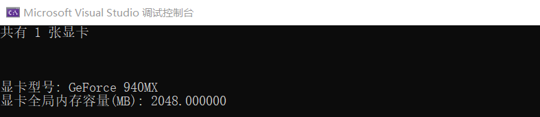
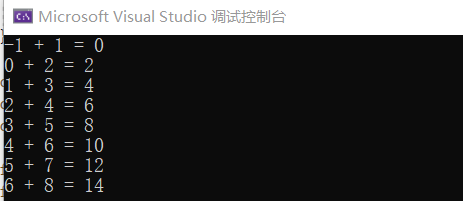
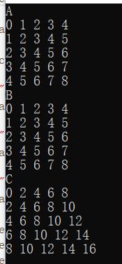
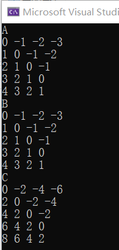
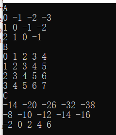

# CudaCode
various cuda code

## 分类

* knn
* naive bayes

## 聚类

* kmeans
* dbscan

## 其他

* 最大熵模型
* EM
* HMM
* CRF
* SVD
* PCA
* 潜在语义分析
* 概率潜在语义分析
* LDA
* PageRank

# 参考

* <https://zhuanlan.zhihu.com/p/34587739>
* 

# 开发环境

* win10
* vs2019
* cuda10.0

# 结果

* hello_word_from_gpu.cu

  

* device_query.cu

  

* vector_add_0.cu

  

  

* matrix_add_0.cu

  

* matrix_add_1.cu

  

* matrix_mul_0.cu

  

* 

